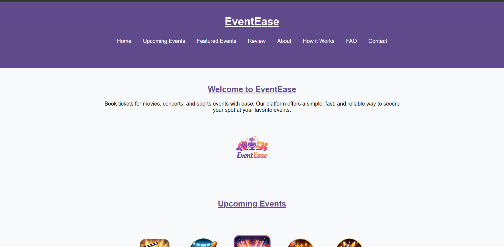
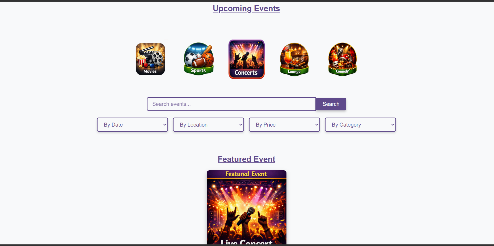
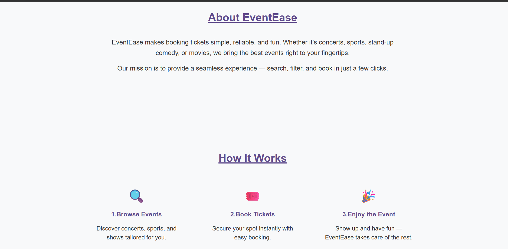
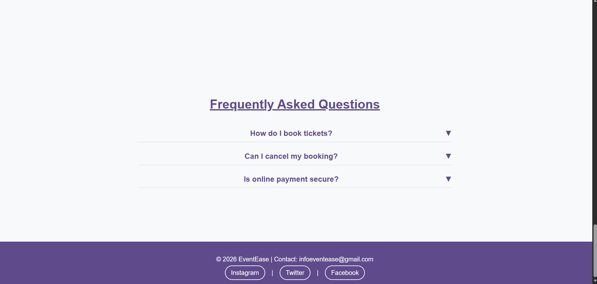
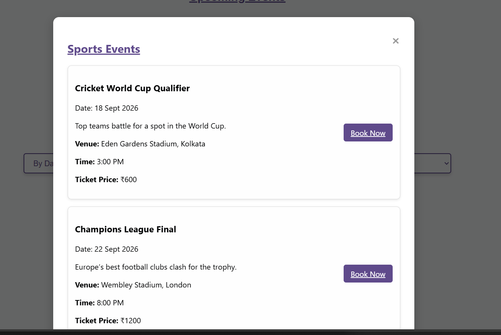
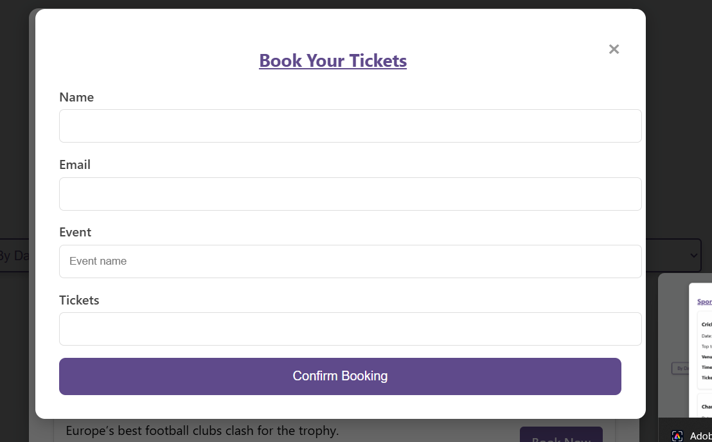

# EventEase_frontend_project
A front-end project built during my internship at Sysslan IT Solutions using HTML, CSS, and JavaScript. The website allows users to browse events (movies, concerts, sports), view details, and book tickets through an interactive and responsive interface.

# 🎟️ EventEase – Responsive Ticket Booking Website

A front-end project developed as part of my internship at **Sysslan IT Solutions**.  
This website allows users to browse events (movies, concerts, sports), view details, and book tickets through an interactive and responsive interface.

---

## 🛠️ Tech Stack
- **HTML5** → Semantic structure and layout  
- **CSS3** → Styling, spacing, and responsive design  
- **JavaScript (ES6)** → Interactivity, DOM manipulation, form validation  

---

## 🔑 Key Features
- Navigation bar with links: Home, Events, Booking, Contact  
- Introduction section explaining the purpose of the website  
- Multiple event cards with images/icons for easy identification  
- “Book Ticket” button on each event card (UI)  
- Event details section showing venue, time, and ticket price  
- Interactive elements:  
  - Button appearance changes when clicked  
  - Show/hide event details toggle  
- Booking form with validation (name, email, event selection, ticket count)  
- Fully responsive design across mobile, tablet, and desktop  

---

## 💡 Skills Strengthened
- Building semantic and reusable components  
- Applying modern CSS styling for clean, consistent design  
- Enhancing user engagement with interactive UI elements  
- Ensuring cross-device responsiveness and usability  
- Practicing front-end best practices in real-world project delivery  

---

## 📸 Project Screenshots

### Homepage

### Event Cards

### About

### Responsive View

### Booking form

---

